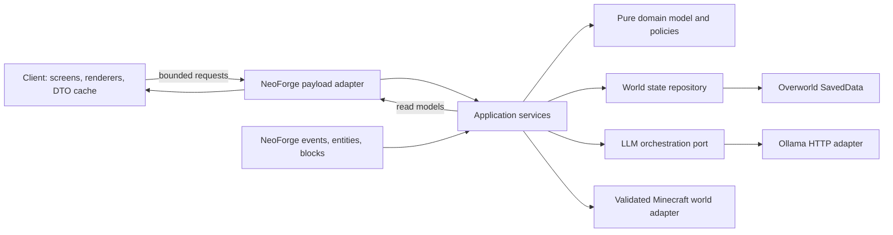
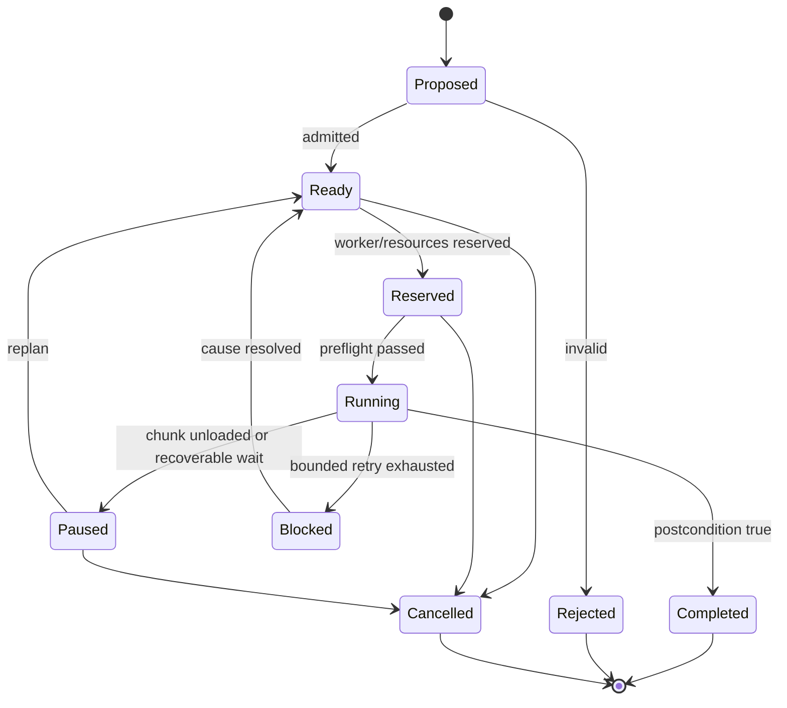
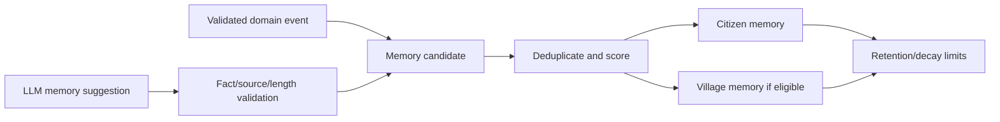
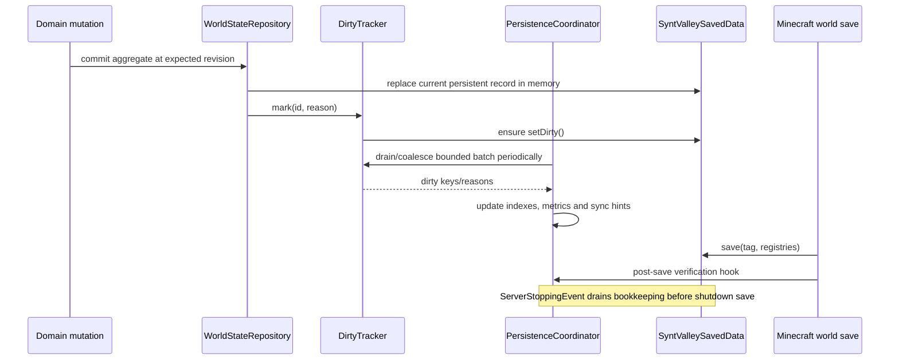

# SyntValley — архитектура

Статус: целевая архитектура  
Runtime: Minecraft 1.21.1 / NeoForge 1.21.1 / Java 21  
Root package: `dev.syntvalley`

## 1. Архитектурные принципы

1. **Server authoritative.** Каноническое состояние существует только на logical server. Клиент хранит read-only UI cache и отправляет намерения пользователя.
2. **Hybrid AI.** Java отвечает за истинность, безопасность и исполнение; LLM — за редкое семантическое разнообразие.
3. **Ports and adapters.** Domain/application не знают об Ollama HTTP, экранах и по возможности о NeoForge API.
4. **Stable identity.** Деревни, жители, задачи, проекты, решения и воспоминания имеют UUID/typed identifiers, независимые от runtime entity id.
5. **Bounded everything.** Очереди, журналы, память, строковые поля, число действий и время работы имеют пределы.
6. **No Minecraft objects off-thread.** Async-код получает только immutable snapshots/value objects и возвращает immutable result.
7. **Validate twice where the world can change.** Намерение проверяется при принятии, а опасный task step — повторно непосредственно перед исполнением.
8. **Cadence over per-tick polling.** У каждой подсистемы есть частота и budget; жители распределены по фазам.
9. **Persistent model is explicit.** Runtime handles, caches, futures, paths и reservations не сериализуются как случайный object graph.
10. **Vertical evolution.** Каждый development slice использует окончательные boundaries и расширяет их без параллельной временной архитектуры.

## 2. Контекст и слои



Разрешённые направления зависимостей:

- `domain` зависит только от Java 21 и собственных value objects;
- `application` зависит от `domain` и объявляет порты;
- `ai.protocol` зависит от protocol DTO/domain identifiers, но не от entity/block classes;
- `infrastructure`, `content`, `network` и `client` реализуют порты;
- `client` никогда не импортируется из common/server package;
- Ollama adapter не доступен из entity AI goals напрямую;
- persistence codecs не становятся API, через которое меняют агрегаты.

На старте достаточно одного Gradle/NeoForge модуля. Модульность обеспечивается package boundaries и architecture tests; разбивать проект на несколько Gradle subprojects следует только при доказанной пользе.

## 3. Package layout

```text
dev.syntvalley
├─ SyntValleyMod
├─ bootstrap
├─ registry
├─ content
│  ├─ block
│  ├─ blockentity
│  ├─ entity
│  ├─ item
│  └─ menu
├─ domain
│  ├─ identity
│  ├─ village
│  ├─ citizen
│  ├─ need
│  ├─ personality
│  ├─ profession
│  ├─ resource
│  ├─ task
│  ├─ project
│  ├─ memory
│  └─ decision
├─ application
│  ├─ command
│  ├─ query
│  ├─ service
│  ├─ scheduler
│  ├─ simulation
│  ├─ port
│  └─ event
├─ ai
│  ├─ backend
│  ├─ ollama
│  ├─ prompt
│  ├─ protocol
│  └─ orchestration
├─ building
│  ├─ definition
│  ├─ placement
│  └─ execution
├─ persistence
│  ├─ saveddata
│  ├─ codec
│  ├─ migration
│  └─ dirty
├─ network
│  ├─ payload
│  ├─ codec
│  ├─ dto
│  └─ handler
├─ client
│  ├─ cache
│  ├─ screen
│  ├─ render
│  └─ input
├─ config
├─ observability
│  ├─ log
│  ├─ metric
│  └─ debug
└─ test
   └─ support
```

## 4. Bootstrap и lifecycle

### Основные классы

| Класс | Ответственность |
|---|---|
| `SyntValleyMod` | Минимальная common-точка `@Mod`: регистрирует registries, configs, payload registration и lifecycle subscribers. Не хранит world state. |
| `SyntValleyClientMod` | Отдельная client-only `@Mod(dist = Dist.CLIENT)` точка: screens, renderers, client payload handlers. |
| `ModRegistries` | Композиция typed `DeferredRegister` holders; не содержит gameplay logic. |
| `ServerRuntimeManager` | Создаёт один `SyntValleyServerRuntime` на `MinecraftServer`, выдаёт его только в server event context и закрывает при stop. |
| `SyntValleyServerRuntime` | World-scoped composition root: repositories, application services, schedulers, budgets, LLM executor, metrics. |
| `ServerLifecycleSubscriber` | Создание runtime, загрузка state, flush/save hooks, shutdown bounded executors. |
| `ServerTickSubscriber` | Единственная верхнеуровневая точка server tick; делегирует в `SimulationCoordinator`. |

`ServerRuntimeManager` может иметь технический weak/lifecycle registry, но mutable gameplay state не хранится в process-global singletons. На server stop все async submissions запрещаются, очередь отменяется, завершённые immutable results отбрасываются по runtime generation token.

## 5. Registries и content adapters

### Registries

- `ModBlocks`: baseline `synt_core`, `village_console`; explicit storage/project-staging content добавляется только после решения Slice 7 и не заменяет canonical world state.
- `ModItems`: block items, `citizen_contract`/hire item, dev tools только при согласованном scope.
- `ModBlockEntities`: baseline `synt_core`, `village_console`; последующие inventory/staging adapters регистрируются в своём slice с отдельными bounds/lifecycle.
- `ModEntityTypes`: `synt_citizen`.
- `ModMenuTypes`: overview, priority, memory/decision log, debug, citizen chat при необходимости menu-backed UI.
- `ModDataComponents`: только для данных ItemStack, например привязка контракта; не заменяют world save.
- `ModAttachments`: использовать лишь для локальных данных holder’а, когда это лучше `SavedData`; canonical Citizen/Village state сюда не переносится.

### Блоки

| Класс | Ответственность |
|---|---|
| `SyntCoreBlock` | Server-side placement/use/removal hooks. Не реализует симуляцию в block tick. |
| `SyntCoreBlockEntity` | Содержит `VillageId`, binding revision и минимальное состояние визуализации; вызывает `setChanged()` при изменении binding. |
| `VillageConsoleBlock` | Запрашивает server-authorized открытие Overview. |
| `VillageConsoleBlockEntity` | Содержит привязку к `VillageId`; не дублирует жителей/задачи/память. |
| `CoreBindingService` | Создание, восстановление, rebind и orphan lifecycle; единственное место изменения связи Core ↔ Village. |

Удаление Core не удаляет village record автоматически. Статус меняется на `ORPHANED`, resident tasks безопасно приостанавливаются, а rebind/delete выполняются отдельной подтверждённой операцией.

### Citizen entity

`SyntCitizenEntity` наследуется от `PathfinderMob`, а не от `Villager`/`AbstractVillager`. Это позволяет использовать базовые возможности living entity, navigation и goal selector, не принимать vanilla villager Brain, gossip, trading и POI lifecycle как скрытую доменную модель.

| Класс | Ответственность |
|---|---|
| `SyntCitizenEntity` | World presence, synced visual data, hurt/death/interact hooks, ссылка на `CitizenId`; не владеет LLM-клиентом. |
| `CitizenEntityBinding` | Typed binding `{citizenId, villageId, bindingGeneration}` и codec для entity NBT. |
| `CitizenEntityReconciler` | При spawn/load проверяет canonical record, предотвращает duplicate binding и обновляет entity presence. |
| `CitizenMoveControlAdapter` | Исполняет разрешённые movement steps через Minecraft navigation. |
| `CitizenInteractionHandler` | На server проверяет distance/state и инициирует chat session/read model. |
| `CitizenRenderer` / `CitizenModel` | Client-only vanilla-like визуализация. |

Entity NBT хранит binding и данные, без которых сущность нельзя корректно связать при загрузке. Личность, память, потребности и задачи канонически находятся в world state. Runtime entity id никогда не сериализуется как identity.

## 6. Domain model

### Typed identifiers

`VillageId`, `CitizenId`, `TaskId`, `ProjectId`, `MemoryId`, `DecisionId`, `RequestId` — отдельные value types вокруг UUID. Нельзя передавать сырой UUID там, где тип контекста известен.

`DefinitionId`/`ResourceLocation` используется для data-driven definitions: профессий, шаблонов строений, типов задач и item tags. Save хранит namespaced identifiers, а отсутствие definition после обновления переводит объект в recoverable `MISSING_DEFINITION`, не вызывает crash.

### Агрегаты и сущности

| Тип | Ключевые данные | Инварианты |
|---|---|---|
| `VillageAggregate` | identity, lifecycle, core binding, policies, resident ids, shared memory, priorities, project/task refs, revision | Один active core binding; resident принадлежит не более чем одной village; revision растёт при commit. |
| `CitizenAggregate` | identity, village, lifecycle, profile, profession, needs, mood, personality, habits, memory refs, active task | Не более одной active task; normalized bounds; entity presence может отсутствовать. |
| `TaskAggregate` | kind, owner, state, priority, inputs, reservations, progress, retry data, parent project | Переходы только по state machine; completed/cancelled terminal; reservations освобождаются. |
| `ProjectAggregate` | type/template, proposer, state, placement plan, bill of materials, task refs | Block operations появляются только после validated placement plan. |
| `MemoryRecord` | subject, kind, summary, participants, game time, salience, confidence, source | Ограниченные строки/refs; source отличает observed, player-said, LLM-suggested, system. |
| `DecisionRecord` | request/snapshot revision, proposal summary, validation outcome/reason, created/expiry | Append/bounded audit; reasoning trace модели не сохраняется. |

### Services и policies

- `NeedUpdatePolicy`: обновляет needs по elapsed game time и событиям.
- `MoodPolicy`: вычисляет bounded mood modifiers из needs/events/memories.
- `PersonalityScoringPolicy`: влияет только на soft scores, не обходя safety constraints.
- `TaskSelectionPolicy`: ранжирует feasible tasks.
- `VillagePriorityPolicy`: объединяет base weights, кризисные overrides и разрешённые proposals.
- `MemoryRetentionPolicy`: дедупликация, decay, pinning ключевых событий, лимиты.
- `ProjectAdmissionPolicy`: проверяет дубли, capacity, policy и ожидаемую ценность до world preflight.
- `ResourceReservationPolicy`: атомарное логическое резервирование, предотвращающее двойной расход.

Domain methods возвращают domain events/results, а не вызывают networking, save или LLM.

## 7. Application layer

### Commands и queries

Commands изменяют состояние на server thread и содержат actor/context:

- `CreateVillageCommand`
- `BindCoreCommand`
- `HireCitizenCommand`
- `AcceptIntentCommand`
- `CreateProjectCommand`
- `ChangeVillagePriorityCommand`
- `SubmitCitizenMessageCommand`
- `CancelTaskCommand`

Queries строят immutable read models:

- `VillageOverviewQuery`
- `CitizenConversationQuery`
- `DecisionLogQuery`
- `DebugStateQuery`

Command handler проверяет expected revision, permissions и domain invariants. Network handler не меняет repository напрямую.

### Порты

| Port | Назначение |
|---|---|
| `VillageStateRepository` | Загрузка/commit world-scoped aggregate state и revision control. |
| `WorldAccessPort` | Ограниченные read checks: loaded chunk, block state, entity presence, protection/collision. |
| `WorldActionPort` | Исполнение только typed validated task steps. |
| `DefinitionRepository` | Профессии, task definitions, building templates и policy data. |
| `LlmBackend` | Async generation из backend-neutral request в backend-neutral raw/structured result. |
| `DecisionSubmissionPort` | Bounded постановка decision job, cancellation и status. |
| `ClientSyncPort` | Отправка versioned DTO определённым игрокам. |
| `ClockPort` | Server game time и monotonic wall clock для timeout/metrics. |
| `MetricSink` | Counters/timers/gauges без зависимости domain от логгера. |

### Application services

- `VillageApplicationService`: создание, binding, policies, queries.
- `CitizenApplicationService`: hire/lifecycle/chat context.
- `TaskApplicationService`: create/transition/cancel/complete.
- `ProjectApplicationService`: proposal → admission → placement → tasks.
- `DecisionApplicationService`: snapshot, validation, commit, audit.
- `PersistenceCoordinator`: dirty-key coalescing, periodic flush bookkeeping, save hooks.
- `SyncCoordinator`: subscriptions, revisions, snapshots/deltas.

## 8. Planner, tasks и исполнение

### Разделение уровней

1. **Intent** — «получить устойчивый запас древесины».
2. **Project** — «построить склад по `syntvalley:small_storehouse`».
3. **Task** — «доставить 16 досок в project staging inventory».
4. **Task step** — `NAVIGATE_TO`, `RESERVE_ITEMS`, `TRANSFER_ITEMS`, `PLACE_TEMPLATE_BLOCK`.

LLM имеет доступ только к уровню intent/proposal. Project admission, task decomposition и все steps принадлежат Java.

### Task state machine



`TaskScheduler` использует priority queue с fairness/aging, но очередь имеет верхний предел на village и citizen. `TaskLease` связывает задачу с работником на ограниченное время. После unload/restart lease не восстанавливается как доверенная истина: task проходит reconciliation.

`TaskExecutor` исполняет не больше заданного количества steps за tick и никогда не удерживает Java monitor/lock через tick. Каждый world-mutating step получает `ExecutionContext`, выполняет loaded-chunk/protection/resource/precondition checks и возвращает typed outcome.

### Pathfinding

- Pathfinding инициируется Java только для active task.
- Одновременные дорогие path requests ограничены per-village budget.
- Failure имеет reason (`NO_PATH`, `TARGET_UNLOADED`, `TIMEOUT`, `OBSTRUCTED`) и bounded retry/backoff.
- LLM не получает координатный контроль и не «чинит» path командами.
- После нескольких неудач planner выбирает альтернативу, просит игрока помочь или блокирует task с видимой причиной.

## 9. Needs, personality и memory

### Cadence

- Быстрые safety checks: когда entity активна/получает событие.
- Needs: пакетами, например раз в 20–100 ticks со staggered offset; конкретные значения конфигурируемы после профилирования.
- Mood aggregation: существенно реже или event-driven.
- Habit/statistical updates: на завершении релевантной задачи.
- Memory retention/compaction: редкая village maintenance job с budget.

Elapsed-time formulas используют `lastUpdatedGameTime`, поэтому пропуск cadence не меняет итоговую скорость. Offline elapsed time по умолчанию не симулируется; при будущем offline mode применяется отдельная coarse policy.

### Memory pipeline



LLM может предложить формулировку/значимость, но не объявить событие произошедшим. `source=PLAYER_SAID` и `source=LLM_SUGGESTED` не превращаются в `OBSERVED_FACT` без server evidence.

## 10. Building и resource accounting

### Definitions

Building templates являются data-pack ресурсами с:

- versioned template id;
- structure/template reference;
- footprint, anchors и allowed rotations;
- bill of materials через item/block tags;
- placement rules, clearance и protected block policy;
- stages для постепенного исполнения;
- semantic roles: home, farm, storage, workshop.

`BuildingPlacementPlanner` детерминированно генерирует кандидатов вокруг разрешённых zones, оценивает slope/collision/access, затем `BuildingPlacementValidator` проверяет выбранный immutable plan на server thread. План содержит конкретные позиции только после Java-планирования.

### Resource flow

`ResourceLedger` — сводный индекс, а не источник предметов. Истина остаётся в server inventories. Индекс обновляется событиями/периодическим reconciliation. Перед расходом `ResourceReservation` резервирует конкретные sources/amounts; непосредственно при transfer/place Java повторно проверяет наличие.

Другие моды и игрок могут менять inventories между планированием и исполнением, поэтому optimistic plan всегда допускает `STALE_RESOURCE_VIEW` и replan.

## 11. LLM subsystem

### Components

| Класс | Ответственность |
|---|---|
| `LlmBackend` | Backend-neutral async interface. |
| `OllamaLlmBackend` | HTTP adapter к `/api/chat` или `/api/generate`; non-streaming structured response для protocol jobs. |
| `BoundedLlmExecutor` | Fixed concurrency, bounded queue, rejection policy, timeout/cancellation. |
| `LlmCircuitBreaker` | Opens после bounded failures, probes health после cooldown. |
| `DecisionScheduler` | Решает, кому/когда нужен LLM, применяет cooldown и quotas. |
| `DecisionSnapshotFactory` | На server thread строит минимальный immutable factual snapshot. |
| `PromptBuilder` | System contract + schema + bounded context; player text экранируется как untrusted data. |
| `ActionResponseParser` | Строгий разбор размера/JSON/schema/protocol version. |
| `ActionValidatorChain` | Correlation, bounds, authority, references, staleness, policy, feasibility. |
| `ActionExecutor` | Превращает validated semantic action в application command; не работает off-thread. |
| `DecisionAuditService` | Сохраняет outcome, timing, reason codes, но не chain-of-thought. |

Для `qwen3:8b` adapter запрашивает structured output по JSON schema, `stream=false`, низкую temperature и `think=false` для protocol decisions. Thinking trace не парсится как action и не сохраняется. Возможность Ollama structured outputs и отдельного thinking field подтверждена официальной документацией, но валидатор остаётся обязательным: schema generation не является security boundary.

### Bounded executor defaults как отправная точка

Значения ниже — безопасная начальная гипотеза, а не обещание производительности:

- workers: `2`;
- global queue: `32`–`64` jobs;
- per-village in-flight: `1` strategic job;
- per-citizen in-flight: `1`, с длительным cooldown;
- connect timeout: несколько секунд;
- request deadline: десятки секунд, configurable upper bound;
- retries: максимум один для transient transport/5xx; schema/safety rejection не повторяется как тот же action;
- optional repair attempt: максимум один и только для синтаксически повреждённого ответа, с отдельной quota;
- overload: immediate `REJECTED_OVERLOAD` и deterministic fallback.

Ни один callback не обращается к Minecraft state. Completion помещается в bounded `DecisionCompletionInbox`; `SimulationCoordinator` снимает ограниченное число completions на server tick, сверяет runtime generation/request/revision и только затем вызывает validator/executor.

### LLM flow

```mermaid
sequenceDiagram
    participant Tick as Server tick
    participant DS as DecisionScheduler
    participant Snap as SnapshotFactory
    participant Exec as BoundedLlmExecutor
    participant Ollama as Ollama
    participant Inbox as CompletionInbox
    participant Val as ValidatorChain
    participant App as ApplicationService

    Tick->>DS: find eligible decision candidate
    DS->>Snap: build immutable bounded snapshot
    Snap-->>DS: snapshot + revision + requestId
    DS->>Exec: trySubmit(job)
    alt accepted
        Exec->>Ollama: async structured request
        Ollama-->>Exec: response/error
        Exec->>Inbox: immutable completion
    else overloaded/open circuit
        Exec-->>DS: typed rejection
        DS->>App: deterministic fallback if needed
    end
    Tick->>Inbox: drain up to budget
    Inbox-->>Val: completion
    Val->>Val: parse, correlate, authorize, re-check state
    alt valid
        Val->>App: execute typed command on server thread
    else invalid/stale/unsafe
        Val->>App: audit rejection; optional fallback
    end
```

Полный wire contract находится в `LLM_ACTION_PROTOCOL.md`.

## 12. Simulation и tick flow

### Координатор

`SimulationCoordinator` вызывается в конце logical server tick. Он не делает полный обход всех объектов без budget. `TickBudgetManager` выдаёт лимиты по категориям, `WorkCursor` хранит round-robin позицию между tick’ами.

Порядок одного tick:

1. Проверить runtime lifecycle и измеритель tick.
2. Снять ограниченное число LLM completions; применить только на server thread.
3. Обработать high-priority domain events: death, core removal, resource invalidation.
4. Выбрать active villages, у которых relevant chunks загружены.
5. Выполнить bounded fast simulation batch: safety, needs due, task steps due.
6. Выполнить scheduler maintenance: expired leases/reservations, blocked task wakeups.
7. Поставить редкие decision jobs, если есть quota и event threshold.
8. Обслужить ограниченное число dirty keys/derived indexes; canonical in-memory `SavedData` records и marker уже обновлены соответствующими commit’ами.
9. Сформировать sync deltas только для подписанных/open-screen игроков.
10. Записать budget/latency metrics; при превышении отложить optional work.

Entity tick выполняет только локальную living/navigation анимацию и делегирует доменные переходы runtime service. Стратегический village planner не запускается из каждого entity tick.

### Budget degradation

При перегрузке работа деградирует в таком порядке:

1. откладываются debug metrics aggregation и low-salience memory maintenance;
2. откладываются новые LLM jobs;
3. уменьшается число non-critical task planning operations;
4. сохраняются safety, active task consistency, lifecycle и dirty tracking;
5. ни при каких условиях не пропускается validation уже выполняемой world mutation.

## 13. Persistence

### Topology

`SyntValleySavedData` прикрепляется к Overworld `DimensionDataStorage`, потому что деревни и жители могут ссылаться на разные dimensions, а Overworld является стабильной world-scoped точкой хранения для ветки 1.21.1.

Каноническая запись — versioned NBT через `SavedData`. JSON используется для data-driven definitions и опционального admin/debug export, но не как параллельный authoritative save.

### Components

| Класс | Ответственность |
|---|---|
| `SyntValleySavedData` | Владеет актуальным нормализованным in-memory root state и интеграцией `setDirty()`/штатного world save. |
| `WorldStateCodec` | Явное NBT-кодирование текущей schema; не сериализация произвольных runtime classes. |
| `MigrationRegistry` | Непрерывная цепочка `vN -> vN+1`; не изменяет source tag in place без копии. |
| `WorldStateRepositoryImpl` | Unit-of-work на server thread, revisions и aggregate access. |
| `DirtyTracker` | Deduplicated typed dirty keys/reasons; при первом dirty commit гарантирует dirty marker root state. |
| `PersistenceCoordinator` | Bounded coalescing/flush bookkeeping, save hooks и metrics; не является отдельным источником истины. |
| `StateReconciler` | После load связывает entity/core presence и переводит незавершённые runtime-dependent states. |

`WorldStateRepositoryImpl` при успешном commit атомарно заменяет соответствующую immutable persistent record в актуальном in-memory root `SyntValleySavedData`. Затем `DirtyTracker` помечает aggregate key и немедленно гарантирует `setDirty()` для root (повторный вызов дёшев и не пишет файл). Очередь нужна для дедупликации причин, derived indexes/read models, metrics и контролируемого flush bookkeeping; она не держит единственную копию нового состояния.

На periodic cadence coordinator bounded-порциями обслуживает dirty keys. В закреплённом Minecraft/NeoForge 1.21.1 `LevelEvent.Save` публикуется после `DimensionDataStorage#save`, поэтому он служит только post-save verification/metrics hook. Full bookkeeping drain выполняется в `ServerStoppingEvent` до shutdown save; корректность сериализуемого root в любом случае не зависит от очереди или порядка hooks: актуальные records уже находятся в `SavedData`, а dirty marker поставлен при commit. Физической записью `.dat` управляет штатный world save.

### Save/load flow



Подробная schema и recovery semantics находятся в `SAVE_FORMAT.md`.

## 14. Networking и UI sync

NeoForge `CustomPacketPayload` и `StreamCodec` используются с версией protocol registrar. Payloads разделяются по направлению; bidirectional type не применяется по умолчанию, если semantics односторонние.

### Read model pattern

- Server query строит `VillageOverviewDto(revision, ...)`.
- Client cache хранит DTO по screen/session id.
- Screen рендерит cache и показывает loading/stale/error states.
- User action отправляет request с target id и expected revision.
- Server проверяет sender/context/permission и отвечает accepted snapshot либо structured error.
- При открытом экране server может отправлять coalesced delta; после revision gap клиент запрашивает новый snapshot.

Нельзя отправлять полный persistent record, prompt, raw LLM response, secret config или весь журнал. Размеры строк/списков проверяются codec/handler до application service.

### Side separation

- `dev.syntvalley.client..` может импортировать `network.dto`, но common packages не импортируют `client`.
- `net.minecraft.client..` встречается только в client source/package entry points.
- Screen registration и entity renderer выполняются в `SyntValleyClientMod`.
- Dedicated-server smoke test обязателен для каждого slice, затрагивающего registries/network/UI.

Подробности payload matrix и security — в `MULTIPLAYER_PLAN.md`.

## 15. Config, logging и metrics

### Config

`SyntValleyConfig` разделён на `CommonConfig`, `ServerConfig`, `ClientConfig`. Validation normalizes ranges при load/reload. Изменение executor capacity, backend или protocol-sensitive параметров либо применяется через controlled runtime reconfigure, либо требует restart и явно сообщается.

### Error taxonomy

- `DomainRejection`: ожидаемое нарушение правила; без stack trace на каждом повторе.
- `ProtocolRejection`: parse/schema/auth/stale/unsafe reason code.
- `BackendFailure`: timeout, connection, HTTP, malformed envelope.
- `WorldActionFailure`: unloaded, protected, no path, stale resource, obstruction.
- `PersistenceFailure`: unsupported schema, migration failure, codec corruption.
- `InvariantViolation`: bug; error log, circuit/feature isolation, тест-регрессия.

`RateLimitedLogger` агрегирует одинаковые failures по ключу `(category, village/citizen, reason)` и периодически пишет suppressed count. Player input и prompts санитизируются; secrets/raw full responses не логируются по умолчанию.

### Metrics

- server simulation time total/by category;
- active/paused/blocked tasks;
- LLM queue depth, in-flight, rejected, timeout, parse/validation outcomes;
- prompt/output chars or backend token metrics;
- decision latency and age;
- dirty key count, last bookkeeping flush/save, migration count;
- sync snapshot/delta bytes and rejected client requests;
- path failures/retries and project progress.

## 16. Future offline simulation seam

`SimulationMode` имеет `LOADED_ENTITY` и будущий `OFFLINE_COARSE`. Первые срезы реализуют только первый режим. Domain transitions принимают elapsed game time/value context, но offline adapter не притворяется обычным entity tick.

Будущий coarse simulator может изменять только явно разрешённые агрегированные величины: needs drift, abstract production/consumption и timers. Он не размещает блоки, не двигает предметы из реальных inventories и не моделирует path/combat. При возвращении loaded chunks выполняется reconciliation, а не проигрывание тысяч скрытых block actions.

## 17. Testing architecture

### Unit tests

- domain policies/state machines;
- score bounds и deterministic seeded decisions;
- protocol parser/validator/rejection codes;
- save codecs/migrations/round-trip/golden fixtures;
- prompt bounds и injection-resistant quoting;
- queue/retry/circuit-breaker behaviour с fake clock/backend;
- DTO codecs и revision rules.

### Game Tests

- placement/removal/rebind Synt Core;
- save/reload identity scenario, если harness поддерживает lifecycle; иначе integration fixture + manual restart test;
- citizen binding/death/unload reconciliation;
- task movement/resource/build step preconditions;
- protected/obstructed building rejection;
- menu opening context and server-side permission where feasible.

### Smoke and soak

- `runGameTestServer` для registered Game Tests;
- dedicated `runServer` без client classes и без Ollama;
- fake backend latency/timeout/invalid-response soak;
- много жителей с фиксированным seed и профилированием tick budget;
- multiplayer two-client manual matrix перед выпуском network/UI slices.

NeoForge 1.21.1 Game Tests используют templates и `runGameTestServer`; run config должен быть настроен так, чтобы exit code корректно отражал тесты.

## 18. Dependency rules для автоматической проверки

После scaffold slice добавить architecture tests или эквивалентные статические проверки:

- `domain..` не зависит от `net.minecraft..`, `net.neoforged..`, `ai.ollama..`, `client..`;
- `application..` не зависит от `client..` и конкретного `OllamaLlmBackend`;
- `common/server..` не зависит от `net.minecraft.client..`;
- `content.entity..` не создаёт HTTP clients и не парсит JSON protocol;
- `network.handler..` вызывает application command/query services, а не repositories/world mutations напрямую;
- `ai.ollama..` не зависит от content entities/blocks;
- migrations не зависят от live world/entity objects.

## 19. Implementation constraints

- Slice 1 закрепил официальный MDK-набор для Minecraft 1.21.1: NeoForge `21.1.235`, ModDevGradle `2.0.141`, Gradle Wrapper `9.2.1`, Parchment `2024.11.17` и Java toolchain/release `21`.
- Прямой доступ к internals vanilla villager Brain не является extension point проекта.
- Сторонняя block-claim/protection интеграция реализуется отдельным adapter’ом; отсутствие adapter не означает автоматическое право менять любой блок.
- Все public protocol/save/network fields имеют документированные bounds и version semantics.
- Любое отступление от этих границ требует записи решения в `RISKS_AND_DECISIONS.md` и обновления затронутых contracts до кода.

## 20. Primary references

- [NeoForge 1.21.1 — Sides](https://docs.neoforged.net/docs/1.21.1/concepts/sides/)
- [NeoForge 1.21.1 — Saved Data](https://docs.neoforged.net/docs/1.21.1/datastorage/saveddata/)
- [NeoForge 1.21.1 — Data Attachments](https://docs.neoforged.net/docs/1.21.1/datastorage/attachments/)
- [NeoForge 1.21.1 — Registering Payloads](https://docs.neoforged.net/docs/1.21.1/networking/payload/)
- [NeoForge 1.21.1 — Menus](https://docs.neoforged.net/docs/1.21.1/gui/menus/)
- [NeoForge 1.21.1 — Game Tests](https://docs.neoforged.net/docs/1.21.1/misc/gametest/)
- [Ollama — Generate API](https://docs.ollama.com/api/generate)
- [Ollama — Structured Outputs](https://docs.ollama.com/capabilities/structured-outputs)
