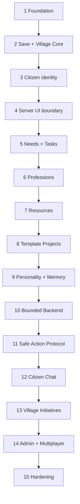

# SyntValley — development slices

Статус: executable roadmap  
Принцип: каждый slice компилируется, тестируется, даёт наблюдаемый результат и расширяет окончательную архитектуру

## 1. Как пользоваться документом

Каждый coding-заход реализует **один** slice, если явно не согласовано иное. Агент сначала читает `AGENTS.md`, этот slice и связанные contract documents, затем проверяет текущее состояние репозитория. Он не реализует функции следующих slices «заодно».

Удобные соответствия для отдельных запросов:

- «реализуй Scaffold/Foundation» → Slice 1;
- «реализуй Save System» → Slice 2;
- «реализуй Citizen Entity» → Slice 3;
- «реализуй Village Overview» → Slice 4;
- «реализуй Task/Needs Loop» → Slice 5;
- «реализуй Resource Accounting» → Slice 7;
- «реализуй Building Template System» → Slice 8;
- «реализуй Memory System» → Slice 9;
- «реализуй bounded Ollama backend» → Slice 10;
- «реализуй LLM Action Protocol» → Slice 11;
- «реализуй Citizen Chat» → Slice 12.

Если фактический код обнаруживает противоречие в документах, slice останавливается на минимально необходимом contract update с записью решения в `RISKS_AND_DECISIONS.md`; нельзя молча обойти архитектуру.

## 2. Definition of Done для каждого slice

Slice завершён, только если:

1. Scope и non-goals соблюдены.
2. Production code не содержит temporary parallel architecture или TODO, без которого acceptance фактически не выполняется.
3. `gradlew.bat build` проходит на Windows; `./gradlew build` остаётся переносимым ожиданием для CI/Linux.
4. Unit/integration/Game Tests, требуемые slice, проходят.
5. Dedicated-server smoke test выполнен, если slice затрагивает registries, content, network или side separation.
6. Ошибки имеют typed outcome/rate-limited logging, а не swallowed exception.
7. Новые collections/queues/strings/packets имеют bounds.
8. Persistent/network/protocol fields обновлены в contract docs, если изменились.
9. User-visible ресурсы (lang, model, texture placeholder, recipes/loot where required) присутствуют.
10. `git diff` не содержит unrelated changes, generated run files, secrets, world saves или IDE caches.

Команды фактически уточняются Slice 1, но базовый набор после scaffold:

```powershell
.\gradlew.bat build
.\gradlew.bat test
.\gradlew.bat runGameTestServer
```

`runClient`/`runServer` — smoke/manual runs, не замена automated tests.

---

## Slice 1 — NeoForge foundation и архитектурные ограждения

### Цель

Создать минимальный, но окончательно организованный NeoForge 1.21.1 / Java 21 проект, который собирается, запускается на client и dedicated server и готов к вертикальным расширениям без переезда package layout.

### Зависимости

Нет. Репозиторий содержит только архитектурный пакет.

### Наблюдаемый результат

SyntValley появляется в списке mods; client и dedicated server стартуют с mod id `syntvalley`; пустой Game Test server корректно завершается.

### Файлы/модули

- Gradle wrapper, `settings.gradle`, `build.gradle`, `gradle.properties`.
- `src/main/resources/META-INF/neoforge.mods.toml` и pack/resources.
- `src/main/java/dev/syntvalley/SyntValleyMod.java`.
- `bootstrap`, `registry`, `config`, `observability` package foundations.
- Отдельный client entry point/package без common import client classes.
- `src/test/java` и Game Test source/resource layout.
- `.gitignore`, при необходимости CI workflow отдельным согласованным файлом.

### Реализовать

- Взять проверенный MDK/toolchain именно для Minecraft/NeoForge 1.21.1; закрепить конкретные версии и Gradle wrapper.
- Java toolchain/release 21, UTF-8 compilation/resources.
- Minimal common/client mod entry points и lifecycle log без gameplay state.
- Registration composition points, но не fake blocks/entities.
- Config skeleton с безопасными categories, если NeoForge config registration нужен будущим slices.
- Test dependencies и один pure unit smoke test; настроить `runGameTestServer` с корректным exit behavior.
- Architecture/package dependency test или статическую проверку: domain не зависит от Minecraft, common не зависит от `net.minecraft.client`.
- Документировать реальные build/run/test commands в `AGENTS.md`, если MDK отличается от предположения.

### Acceptance criteria

- `java -version`/Gradle toolchain использует JDK 21.
- Clean checkout выполняет wrapper build без IDE-generated конфигурации.
- Mod metadata: id/name/version/license/authors/description корректны и не содержат template examplemod.
- `runClient` загружает mod без registry errors.
- `runServer` доходит до готовности мира после стандартной dev EULA настройки и не падает из-за client classes.
- `runGameTestServer` доступен и возвращает корректный exit code.
- Ни одного mutable world singleton, LLM dependency или gameplay placeholder.

### Тестировать

- Unit smoke/architecture dependency tests.
- `build`, `runGameTestServer`.
- Manual `runClient` и `runServer` startup/shutdown.
- Проверить JAR contents: mods metadata/resources, отсутствие run/world files.

### Не делать

- Synt Core, Citizen, screens, networking payloads или Ollama.
- Копирование code/layout старого AIMineColonies.
- Выбор API из NeoForge newer than 1.21.1 без проверки.
- Multi-project Gradle layout без доказанной необходимости.

---

## Slice 2 — Save System и persistent Village через Synt Core

### Цель

Реализовать end-to-end поток: игрок ставит Synt Core → server создаёт stable Village → state сохраняется штатным world save → после restart тот же core связан с тем же VillageId. Это фундаментальный Save System, а не локальный NBT workaround.

### Зависимости

Slice 1.

### Наблюдаемый результат

Размещённый Synt Core создаёт деревню с именем/default state; debug log/inspect command показывает VillageId. После save/restart ID и core binding сохраняются. Удаление core переводит village в `ORPHANED`, не стирает её.

### Файлы/модули

- `registry`: block/item/block entity registrations.
- `content.block.SyntCoreBlock`.
- `content.blockentity.SyntCoreBlockEntity`.
- `domain.identity`, `domain.village`.
- `application.service.VillageApplicationService`, `CoreBindingService`.
- `persistence.saveddata`, `persistence.codec`, `persistence.migration`, `persistence.dirty`.
- Server lifecycle/tick save hooks.
- Block assets, model, loot table, translation.
- Unit/codec/Game Tests.

### Реализовать

- Typed `VillageId` и minimal `VillageAggregate` с lifecycle/revision/core location.
- Overworld-scoped `SyntValleySavedData` schema 1 по `SAVE_FORMAT.md`.
- Root collections присутствуют в schema; Slice 2 реально заполняет villages, остальные корректно пусты.
- Explicit codec, load validation, future-version fail closed и migration registry foundation.
- World-scoped repository/runtime, без static gameplay map.
- Deduplicated `DirtyTracker` и `PersistenceCoordinator`: current in-memory `SavedData` record + dirty marker обновляются при commit; periodic/pre-save/stop flush обслуживает bounded bookkeeping, не отдельную копию истины.
- Synt Core placement/create/bind/remove/orphan/rebind rules на logical server.
- Local BE binding NBT содержит только VillageId/generation.
- Controlled debug inspect command или server log с bounded output для acceptance; не полноценный debug screen.

### Acceptance criteria

- Placement на server создаёт ровно одну Village и binding.
- Repeated load/use не создаёт duplicate Village.
- Save/restart сохраняет VillageId, revision, name/lifecycle, dimension/position.
- Core break/explosion переводит state в `ORPHANED`; повторная загрузка не удаляет запись.
- Несколько placement callbacks/replayed events идемпотентны в рамках binding operation.
- Dirty mutations не вызывают custom disk write каждый tick; pre-save flush сохраняет latest revision.
- Invalid duplicate/future schema не молча превращается в пустой мир.
- Dedicated server работает без client linkage.

### Тестировать

- Domain lifecycle transitions и expected revision.
- Empty/full minimal NBT round-trip, Unicode name, negative position/dimension.
- Duplicate IDs, invalid bounds, future schema, migration registry behavior.
- Dirty coalescing и no-drop/full-drain.
- Game Test: placement creates binding; break creates orphan; duplicate placement path.
- Manual save/stop/restart world verification.

### Не делать

- Citizen records/entity, tasks, LLM, overview UI.
- JSON-per-village save или ручной canonical file writer.
- Удаление Village при break Core.
- Полную будущую schema «на всякий случай» с неиспользуемыми runtime classes; только стабильные contract records/bounds.

---

## Slice 3 — Custom Citizen, найм и identity reconciliation

### Цель

Добавить собственного жителя с постоянной идентичностью и корректным lifecycle, не наследуя vanilla Villager AI. Житель пока не «умный», но уже является настоящей окончательной entity/domain связкой.

### Зависимости

Slice 2.

### Наблюдаемый результат

Игрок server-authorized способом нанимает/создаёт Synt Citizen, привязанный к Village. Житель имеет vanilla-like placeholder appearance, имя и остаётся тем же Citizen после unload/save/restart. Death/missing/duplicate binding обрабатываются явно.

### Файлы/модули

- `registry.ModEntityTypes`, hire/contract item registration.
- `content.entity.SyntCitizenEntity`, attributes, binding/reconciler, interaction foundation.
- Client-only model/renderer/layer/texture resources.
- `domain.citizen`, Citizen persistent record/codec.
- `application.service.CitizenApplicationService`, `HireCitizenCommand`.
- Save schema-1 citizen collection support.
- Networking только необходимое vanilla/entity spawn sync; gameplay UI ещё нет.

### Реализовать

- `SyntCitizenEntity` на базе подходящей custom mob superclass (`PathfinderMob` по decision D-002), без `Villager`/Brain ownership.
- Stable `CitizenId` отдельно от Minecraft entity UUID/runtime id.
- Server-only hire/create validation: target Village active, caps, resource/creative policy выбранная Slice task’ом.
- Canonical Citizen record: profile/lifecycle/village/entity binding; future fields получают documented defaults.
- Entity local binding NBT и `CitizenEntityReconciler` с generation/conflict rules.
- Load/unload/death hooks; `MISSING_ENTITY` не означает немедленный respawn.
- Минимальные attributes/navigation/idle behavior, достаточные для безопасной mob entity; не task AI.
- Client renderer с простым оригинальным vanilla-inspired asset, не копированием protected texture.

### Acceptance criteria

- Citizen создаётся только на logical server и принадлежит одной Village.
- Domain CitizenId, entity UUID и runtime entity id различимы и используются правильно.
- Save/restart/unload сохраняет identity/name/village binding без дублей.
- Death создаёт `DECEASED` transition; задача найма не оживляет старую запись случайно.
- Две entity с одним CitizenId не работают одновременно: conflict quarantine/diagnostic.
- Entity без valid Village/Citizen record не создаёт silently новую личность.
- Dedicated server загружает entity без renderer/client class.

### Тестировать

- Citizen codec/lifecycle/binding generation.
- Hire validation/caps/idempotency.
- Reconciler cases: normal, record missing, entity missing, duplicate, stale generation, death.
- Game Test: hire/spawn and binding; entity death transition where stable.
- Manual render/spawn/unload/save/restart.

### Не делать

- Vanilla profession/trading/gossip/breeding.
- Needs, memory, LLM или chat screen.
- Auto-respawn при любой entity absence.
- Финальный сложный art design.

---

## Slice 4 — Village Console, server read models и Overview UI

### Цель

Доказать server-authoritative UI/data flow: отдельный Village Console открывает Overview и получает bounded DTO по NeoForge payloads. Этот slice закладывает multiplayer-ready networking до административных mutations.

### Зависимости

Slice 3.

### Наблюдаемый результат

Игрок размещает/привязывает Village Console, открывает экран и видит имя/lifecycle деревни, Core status и список жителей с identity/name/presence. UI не использует Citizen Chat.

### Файлы/модули

- `content.block.VillageConsoleBlock`, block entity, menu/provider if used.
- `content.menu`/menu type.
- `network.payload`, `network.codec`, `network.dto`, server/client handlers.
- `application.query.VillageOverviewQuery`.
- `application.service.SyncCoordinator`, screen session foundation.
- `client.cache`, `client.screen.VillageOverviewScreen`.
- Models/assets/lang.

### Реализовать

- Console binding к VillageId, server-authorized place/use.
- Network registrar version и directional payload types.
- `VillageOverviewDto` с revision, bounded residents и statuses.
- Initial snapshot request/response; optional simple coalesced refresh/subscription только если завершён корректно.
- Server `ScreenSessionRegistry`: owner, target, position/dimension, expiry.
- Distance/dimension/binding/size/rate checks.
- Client cache lifecycle, loading/stale/error/invalidated states.
- Dedicated physical-side separation.

### Acceptance criteria

- Overview открывается только у valid bound Console и получает state с logical server.
- Client не читает integrated server repository/static fields.
- Forged VillageId, distant/wrong dimension и unbound Console отвергаются.
- Resident list bounded; over-cap отображает count/pagination hint без giant packet.
- Screen close/disconnect очищает session/subscription.
- DTO revision присутствует; unknown/gap приводит к snapshot recovery, если deltas реализованы.
- Survival player может смотреть overview согласно policy, но не менять priorities.

### Тестировать

- DTO/StreamCodec round-trip и bounds.
- Handler context/session/distance/dimension/rate validation.
- Client cache revision transitions как pure tests.
- Game Test: Console binding/use server context where feasible.
- Manual integrated + dedicated server/client open/close/reconnect.

### Не делать

- Priority mutation, memory/debug screens.
- Chat с Citizen.
- Отправку persistent records/raw NBT.
- Периодический broadcast overview всем players без открытого screen.

---

## Slice 5 — Deterministic needs, tick budget и базовый Task loop

### Цель

Сделать жителя наблюдаемо живым без LLM: потребности меняются по elapsed time, scheduler выбирает безопасные Java tasks, task machine переживает pause/restart, а всё работает в tick budget.

### Зависимости

Slice 4.

### Наблюдаемый результат

Citizen чередует bounded idle/work-rest поведение около Village, прерывает необязательное действие при safety/critical rest, сообщает о голоде в Overview alert и может быть накормлен server-authorized взаимодействием. Current activity/need summaries видны в Overview.

### Файлы/модули

- `domain.need`, `domain.task`, `application.scheduler`, `application.simulation`.
- `NeedUpdatePolicy`, `TaskSelectionPolicy`, task state machine/records.
- `SimulationCoordinator`, `TickBudgetManager`, round-robin cursors.
- Entity navigation/task execution adapters.
- Save task/need fields and reconciliation.
- Overview DTO delta/sections for needs/current activity.

### Реализовать

- Need scale/bounds/cadence по `SAVE_FORMAT.md`; elapsed-time update.
- Hard safety/critical need precedence и deterministic scoring.
- Final task states/transitions, `TaskLease`, bounded retries/backoff/outcomes.
- Минимальные реального architecture tasks: rest near validated village/home anchor, safe idle/wander, wait/help/food request; optional direct feed interaction validates held food and consumes it server-side.
- Navigation failure/unloaded chunk outcomes; no force-load.
- Central staggered scheduler, no full every-system/every-citizen tick scan.
- Persist semantic task/progress; restart `RUNNING` → reconciliation.
- Budget/debug counters exposed at least in server diagnostics and Overview summary.

### Acceptance criteria

- Один Citizen проходит need→task→completion transition без LLM.
- Critical safety/rest overrides soft idle; personality пока не требуется.
- Hunger не создаёт предмет: request/alert и valid player feed изменяют state на server.
- Entity в unloaded chunk не симулирует world action; task pauses.
- Navigation/task retry bounded и видим reason.
- Save/restart не повторяет terminal transition и корректно reconciles active task.
- Simulation budget/active cursor измеримы; нет HTTP/LLM code.

### Тестировать

- Need elapsed time/bounds/cadence.
- Task transition property tests, lease expiry, retry cap, priority aging/fairness.
- Deterministic scheduler with fake clock/seed.
- Restart reconciliation fixtures.
- Game Tests: rest/navigation success/failure, feed validation if implemented.
- Soak с несколькими десятками Citizens и tick timing baseline.

### Не делать

- LLM decisions/dialogue.
- Сложные professions/resource delivery/building.
- Simulate offline unloaded chunks.
- Random personality, которая обходит hard constraints.

---

## Slice 6 — Professions и реальный work-task contract

### Цель

Ввести data-driven profession definitions и отделить «кто умеет работать» от task execution. Доказать это одной безопасной, конечной профессией/работой без генеративного поведения.

### Зависимости

Slice 5.

### Наблюдаемый результат

Citizen получает одну из первых профессий, Overview показывает её и activity. Подходящий житель выполняет один bounded work loop, например inspection/maintenance/delivery preparation, и получает experience; неподходящий не берёт задачу.

### Файлы/модули

- `domain.profession`, profession definitions/resources/codecs.
- `DefinitionRepository`/reload listener.
- Profession eligibility/skill/experience policies.
- Profession-aware task factory/scoring.
- Save profession state, missing definition recovery.
- Overview profession/activity fields.

### Реализовать

- Namespaced versioned profession definitions с allowed task kinds/skill modifiers.
- Минимум две различимые definitions для проверки eligibility, но только один полностью исполнимый work loop обязателен.
- Server-authorized assignment/change с cooldown/cap; UX может быть development command или Console read-only indicator до later admin UI.
- Work task использует существующую final task machine и world adapter, не отдельный entity goal architecture.
- Experience/progress bounds; no grind-per-tick writes.
- Datapack reload/missing definition переводит Citizen/task в recoverable state.

### Acceptance criteria

- Profession выбирается по definition id, не enum/class switch, который закрывает future datapacks.
- Wrong profession не принимает task; qualified Citizen завершает loop.
- Experience начисляется ровно один раз на terminal success.
- Definition removal/reload не crash’ит save: status видим и task блокируется безопасно.
- Save/restart сохраняет profession/experience и не дублирует reward.

### Тестировать

- Definition codec/bounds/duplicate ids/reload.
- Eligibility/scoring/experience idempotency.
- Missing definition save/load.
- Game Test выбранного work loop.
- Dedicated server resource reload.

### Не делать

- Большой каталог профессий.
- Vanilla trading/profession inheritance.
- LLM profession change; protocol придёт позже.
- Опасное block breaking как shortcut к «работе».

---

## Slice 7 — Resource accounting и project staging

### Цель

Создать честный ресурсный слой: Java видит только явно связанные village inventories, ведёт bounded ledger-cache, резервирует логически и повторно проверяет реальные ItemStacks. Подготовить staging для проектов без строительства.

### Зависимости

Slice 6.

### Наблюдаемый результат

Игрок создаёт/привязывает project staging или storage endpoint выбранного финального дизайна, кладёт ресурсы и видит сводку в Overview. Delivery/reservation task перемещает разрешённый ресурс или честно блокируется при stale/missing items.

### Файлы/модули

- `domain.resource`, `ResourceLedger`, `ResourceReservationPolicy`.
- `application.port` inventory/resource source adapters.
- `application.service.ResourceApplicationService`.
- Выбранный explicit storage/staging content adapter и assets/menu, если требуется.
- Resource index invalidation/reconciliation.
- Save только semantic requirements/delivery; transient cache/reservations согласно `SAVE_FORMAT.md`.
- Overview resource summaries.

### Реализовать

- На slice planning выбрать и записать один explicit, server-validatable способ связать inventory с Village; нельзя сканировать произвольные chunks/все chests.
- Typed resource keys (items/tags с ясной semantics), quantity bounds.
- Ledger as cache, physical inventory as source of truth.
- Reservation/lease с owner task и expiry; execution-time recheck.
- Один end-to-end resource delivery/staging task с idempotent postcondition.
- Invalidation при player/other mod inventory change либо bounded periodic reconciliation.
- Overview aggregated counts со stale/last-updated indicator, если данные не мгновенные.

### Acceptance criteria

- Unbound/remote/protected inventory не учитывается и не меняется.
- Два tasks не тратят один и тот же reserved stack.
- Player забирает item после plan: task получает `STALE_RESOURCE_VIEW`, не создаёт/дублирует предмет.
- Restart очищает transient reservation и reconciles task/inventory.
- Transfer reward/progress не применяется дважды после retry/restart.
- Ledger scan/update укладывается в budget и bounded area/source count.

### Тестировать

- Reservation conflicts/expiry/release.
- Stale inventory/fingerprint, partial amount, tag matching, caps.
- Task idempotency and restart.
- Game Tests: deposit/count/delivery/player interference/unbound source.
- Performance с максимальным разрешённым числом endpoints.

### Не делать

- World-wide chest scan.
- Resource creation/deletion для «удобства».
- Persistent trust к cache/reservation после restart.
- Building placement или LLM requests.

---

## Slice 8 — Template building projects

### Цель

Реализовать полный безопасный project lifecycle для одной небольшой постройки: proposal/admission → Java placement → resource staging → task stages → completion. Геометрия только из versioned template.

### Зависимости

Slice 7.

### Наблюдаемый результат

Игрок development/Console способом создаёт проект `small_storehouse`, видит validated site/materials/progress, доставляет ресурсы, после чего Citizen постепенно строит template. Obstruction/protected/unloaded state ставит проект на паузу с причиной, а не портит мир.

### Файлы/модули

- `domain.project`, project persistent records/state machine.
- `building.definition`, `building.placement`, `building.execution`.
- Template metadata/data resources и structure fixture.
- `ProjectApplicationService`, task decomposition.
- World protection/precondition port/default conservative adapter.
- Project/resource/placement DTO summaries.
- Game Test structures.

### Реализовать

- Один production-quality template `syntvalley:small_storehouse` с footprint, rotations, bill, stages, version.
- Deterministic candidate generation within Village zone/radius и bounded search.
- Placement validation: loaded chunks, world border/build height, collisions/clearance, replaceable policy, core/console exclusion, conservative protection hook.
- Immutable placement plan/hash и project state persistence.
- Resource delivery/staging, task decomposition и staged block steps.
- Повторная проверка каждого block precondition непосредственно перед placement; unexpected block stops/blocks.
- Cancel/fail/restart semantics; no automatic destructive rollback. Recovery/cleanup explicit.
- Project Overview summary и stable failure codes.

### Acceptance criteria

- LLM не участвует; project запускается typed server command/UI action.
- Один template строится только после resources и valid placement.
- Координаты выбирает Java, не user/JSON free-form command в production path.
- Obstruction/claim/unloaded chunk/resource loss не приводит к overwrite/duplication.
- Save/restart продолжает с корректного stage/postcondition, не ставит блоки второй раз за reward.
- Template version mismatch блокирует/revalidates project.
- Search/placement/task work bounded per tick.

### Тестировать

- Project state machine/admission/duplicate purpose/capacity.
- Placement candidates: slope/collision/border/core/rotation/no candidate.
- Bill/reservation/stage and restart fixtures.
- Game Tests: successful small storehouse, obstruction, resource removal, unload/pause where possible, existing matching block/idempotency.
- Manual claim/protection behavior согласно доступному adapter/default policy.

### Не делать

- Произвольную LLM-generated structure.
- Несколько building categories до качества первого pipeline.
- Мгновенную постройку целиком в один tick.
- Destructive rollback чужих/неожиданных blocks.

---

## Slice 9 — Personality, mood, habits и structured memory

### Цель

Добавить различимость жителей и объяснимые последствия событий без LLM. Memory хранит подтверждённые события с источником и limits; personality меняет только soft task scores.

### Зависимости

Slice 8.

### Наблюдаемый результат

Два Citizens с разными traits по-разному ранжируют необязательную работу/социальный отдых, но одинаково соблюдают safety. Завершение проекта, помощь игрока и death создают bounded memories; Overview/первая read-only Log page показывает причины.

### Файлы/модули

- `domain.personality`, `domain.memory`, `domain.decision` foundation.
- Mood/personality scoring и habit policies.
- Memory candidate/dedupe/retention/decay/source pipeline.
- Save memory records/personality/mood/habits/decision outcomes.
- `DecisionLogQuery`/`MemoryQuery`, pagination DTO и read-only screen/tab.
- Domain event subscribers.

### Реализовать

- Stable deterministic personality defaults; bounded traits.
- Mood derived modifiers из needs/events/memories; только base/required persistent fields.
- Не менее двух soft choices, где traits статистически влияют на score.
- Structured memories для observed project completion, feed/help, death/concern; correct source semantics.
- Per-citizen/village/global caps, dedupe, salience/decay, bounded pinned slots.
- Read-only paginated Memory/Decision Log через Console с screen-session security.
- Decision records пока фиксируют deterministic planner outcomes; тот же audit format позже принимает LLM.

### Acceptance criteria

- Hard safety/critical need никогда не проигрывает personality modifier.
- Одинаковый seed/state воспроизводит tie-break; разные traits дают измеримое, bounded отличие.
- Одно domain event не создаёт дубликаты memory при replay/restart.
- `PLAYER_SAID`/future `LLM_SUGGESTED` не маркируется observed fact.
- Retention caps работают и не удаляют identity/project state.
- UI paginated/bounded, не показывает raw internals.

### Тестировать

- Trait/mood score bounds/monotonic properties.
- Memory dedupe/source/retention/decay/pinning caps.
- Event replay/idempotency/save round-trip.
- Page cursor/session/visibility/size tests.
- Statistical deterministic test без flaky random thresholds.

### Не делать

- LLM summarization/dialogue.
- Full transcript или chain-of-thought storage.
- Personality as random hard-rule bypass.
- Семьи/романтика.

---

## Slice 10 — Bounded LLM backend и deterministic fallback boundary

### Цель

Интегрировать Ollama как заменяемый operational adapter, не позволяя ему пока менять domain/world. Доказать non-blocking, bounded queue, timeout, circuit breaker, metrics и fake backend tests.

### Зависимости

Slice 9.

### Наблюдаемый результат

Server debug status/command показывает backend disabled/healthy/busy/open-circuit и может выполнить безопасный diagnostic generation. При выключенном или зависшем Ollama gameplay/ticks продолжаются; queue не растёт.

### Файлы/модули

- `ai.backend.LlmBackend` и neutral DTO/errors.
- `ai.ollama.OllamaLlmBackend` HTTP adapter.
- `ai.orchestration.BoundedLlmExecutor`, completion inbox, circuit breaker, quotas.
- Server config for enabled/base URL/model/timeouts/capacity; redaction.
- Metrics/rate-limited logs/debug diagnostic surface.
- Fake/scripted backend and concurrency tests.

### Реализовать

- Java 21 HTTP approach/dependency choice, recorded if material.
- Fixed worker count + bounded queue + rejection; no common pool/cached pool.
- Connect/request deadline, cancellation, retry classification/cap, circuit cooldown.
- Runtime generation tokens and shutdown: late results cannot enter stopped/new server state.
- Backend envelope size/status/done/metrics handling; `stream=false` for structured job foundation.
- No Minecraft objects in request/future/callback.
- Completion inbox drained with per-tick cap, but diagnostic result only logs/surfaces status; no action execution.
- Fake backend tests for success, latency, never-completes, malformed/large envelope, overload, stop.

### Acceptance criteria

- Server thread never waits on future/HTTP; automated test/thread assertion covers boundary.
- Queue/worker/inbox are bounded and observable.
- Overload returns typed rejection/fallback signal immediately.
- Timeout/retry finite; repeated failures open circuit; probe/recovery bounded.
- Shutdown prevents new submissions, cancels/abandons pending safely and ignores late completions.
- Ollama absent: dedicated server starts and all deterministic gameplay works.
- Secrets/raw prompt/thinking not in normal logs/network/save.

### Тестировать

- Executor queue saturation/concurrency/fairness/cancellation/shutdown.
- Circuit state with fake clock.
- HTTP adapter mocked responses/status/body caps/metrics.
- Server tick timing with hanging fake backend.
- Optional manual real Ollama `qwen3:8b` diagnostic, never required for CI.

### Не делать

- Action protocol/domain mutation/chat feature.
- Live Ollama dependency in unit/Game Tests.
- Unbounded retry/queue or `join/get` on server thread.
- Sending whole save/world/entity into prompt.

---

## Slice 11 — LLM Action Protocol и validated semantic action

### Цель

Реализовать `LLM_ACTION_PROTOCOL.md` end-to-end для одного citizen decision и одного village proposal, включая strict parse, correlation/capabilities/staleness/policy validation, idempotent commit, audit и fallback.

### Зависимости

Slice 10.

### Наблюдаемый результат

Scripted или real backend может предложить разрешённый `adopt_goal`/`request_resource` и `propose_project`; Java принимает только валидное актуальное предложение. Unknown `place_block`, forged ref и stale response видимы в Decision Log как rejection и не меняют мир.

### Файлы/модули

- `ai.protocol` request/response/action DTO, strict parser/schema, capability registry.
- `ai.prompt.PromptBuilder`, bounded snapshot/fact/catalog factory.
- `ActionValidatorChain`, rejection codes, server-derived DecisionId/replay store.
- `ActionExecutor` → typed application commands.
- `DecisionScheduler` first rare triggers/cooldowns/quotas.
- Decision save/log/read model extensions.
- Protocol fixtures/fuzz/property tests.

### Реализовать

- Full envelope/version/correlation/limits из protocol doc.
- Action codecs/validators как closed typed registrations, без reflection/generic map dispatcher.
- Минимально executable allowed actions: `adopt_goal`, `request_resource`, `propose_project`, `defer_decision`; остальные types можно парсить только если полностью валидируются/аудитируются, иначе оставить до slices.
- Fact/catalog generation только из server state, player text/memory clearly untrusted.
- Strict JSON: no Markdown extraction, duplicates/unknown/size/depth/type caps.
- Completion on server tick: runtime/request/revision/capability/reference/policy/feasibility/world preflight.
- Server-derived idempotent DecisionId, independent proposal outcomes.
- Один optional repair только для разрешённых syntax/shape failures и отдельной quota; no safety retry loop.
- Deterministic fallback по decision kind.

### Acceptance criteria

- Valid current allowlisted proposal вызывает ровно один application command/audit.
- Duplicate completion/replay не создаёт второй goal/request/project.
- Unknown/direct world action always rejected before payload interpretation/world mutation.
- Forged fact/catalog/citizen/template/session ref rejected.
- Stale revision rejected; normal scheduler, а не immediate loop, решает новый request.
- Parser cap соблюдается до giant allocation.
- LLM unavailable/overload/invalid → deterministic result; gameplay continues.
- No raw reasoning/prompt in save/network.

### Тестировать

- Все golden/invalid cases из `LLM_ACTION_PROTOCOL.md`.
- Capability matrix, correlation, expiry, replay, references, staleness, policy.
- Fuzz/property: arbitrary input yields typed reject or validated action, never world mutation/uncaught exception.
- Fake backend end-to-end completion inbox → command/audit.
- Real Ollama optional compatibility with structured schema/`think=false`.

### Не делать

- Добавление `place_block`/coordinates/tools/command action.
- Chat UI (следующий slice).
- Autonomous frequent LLM calls для каждого Citizen.
- Generic «repair until valid».

---

## Slice 12 — Citizen Chat

### Цель

Добавить личный текстовый диалог при взаимодействии с конкретным Citizen, сохраняя server session, prompt safety, async UX, fact grounding, fallback и bounded history.

### Зависимости

Slice 11.

### Наблюдаемый результат

Игрок взаимодействует с Citizen, открывает chat, отправляет короткое сообщение и получает grounded ответ/просьбу. UI показывает pending/busy/fallback. Отдаление, смерть, закрытие session или backend failure обрабатываются корректно.

### Файлы/модули

- Citizen interaction → server chat session.
- Chat C2S/S2C payloads/DTOs/sequence/rate limits.
- `CitizenConversationQuery`, dialogue snapshot/prompt builder.
- Protocol actions `reply_to_player`, `request_help`, optional validated `record_memory`.
- Client chat cache/screen.
- Bounded conversation/memory retention and content validation.

### Реализовать

- Short-lived session owner/citizen/distance/dimension/expiry/context.
- Bounded Unicode message, per-player/session/citizen/global rate limits.
- Player message as untrusted data; facts/catalog and recent bounded turns.
- Immediate accepted/busy/unavailable response и async correlated final update.
- `reply_to_player` fact refs/content bounds; no command execution from text.
- Deterministic localized response from current task/need/request when LLM unavailable.
- Session close/disconnect/death/stop cleanup; late response ignored/audited.
- Memory policy: full transcript not saved; selected `PLAYER_SAID`/validated summary only within cap.

### Acceptance criteria

- Chat opens only through valid nearby Citizen interaction.
- Forged/expired/wrong-owner session and out-of-order/replay sequence rejected.
- Prompt injection example cannot introduce non-capable action.
- Closing screen/session before completion prevents delivery/commit to wrong session.
- LLM failure never freezes UI/Citizen; fallback arrives within server-controlled path.
- One player cannot receive another player’s session turns.
- Dialogue fact claims in UI reference available server facts or are framed as opinion.

### Тестировать

- Session lifecycle/ownership/distance/dimension/expiry.
- Message UTF/byte caps, sequences, rate limits, injection corpus.
- Async close/disconnect/death/server-stop races.
- Fallback content from known facts.
- Two-player manual/integration isolation.

### Не делать

- Voice chat.
- Общий Village Overview через chat.
- Unlimited conversation transcript/context.
- Player granting creative/admin permissions through text.

---

## Slice 13 — Village planning, инициативы и social dynamics

### Цель

Сделать редкие инициативы деревни частью реального gameplay: event thresholds запускают bounded village planning; жители предлагают template projects/priority changes/requests, могут обсуждать конфликтующие soft priorities, а Java решает admission.

### Зависимости

Slice 12.

### Наблюдаемый результат

Длительный дефицит или насыщение склада создаёт объяснимое предложение проекта/ресурса. Конкретный Citizen отображается как proposer. Два Citizens с разными traits могут сформировать разные позиции; итоговая village policy остаётся bounded и журналируется.

### Файлы/модули

- Village event/threshold detector и rare `DecisionScheduler` planning tier.
- Protocol actions `propose_priority_change`, `propose_profession_change`, `initiate_social_interaction`, production `record_memory` validation.
- Village proposal/admission/approval policy and UI summaries.
- Social relationship/interaction task minimal model.
- Decision/memory/project integration.

### Реализовать

- LLM eligibility только для significant event/threshold + cooldown/quota; no periodic per-citizen storm.
- Village snapshot агрегирован и bounded; no full citizen memories.
- Proposal capacity/duplicate/evidence/policy/resource/template validation.
- Approval policy: auto-accept only explicitly safe allowed projects or player approval state, recorded server-side.
- Conflicting priority proposals разрешаются deterministic policy; LLM priority is soft bounded delta.
- Social interaction как scheduled task с consent/availability/cooldown, без teleport/forced path.
- Decision outcome меняет structured memory only after actual accepted/observed event.

### Acceptance criteria

- Repeated same deficit within cooldown не flood’ит LLM/project list.
- Project proposal проходит existing Slice 8 Java placement/resource pipeline; LLM не строит напрямую.
- Duplicate/obsolete proposal rejected/audited.
- Priority delta bounded and cannot override crisis/admin hard policy.
- Social task may pause/fail without blocking Citizens.
- Backend disabled produces deterministic requests/project trigger for documented thresholds.

### Тестировать

- Threshold hysteresis/cooldown/quota/event dedupe.
- Conflicting proposals and personality soft weights.
- Project admission integration/replay/stale state.
- Social target availability/cooldown/path failure.
- Soak queue load с несколькими villages/Citizens.

### Не делать

- Families, romance, breeding, factions, raids.
- LLM-generated block geometry.
- Every-tick/villager planning.
- LLM absolute priority/permission changes.

---

## Slice 14 — Priority Management, Debug UI и multiplayer security completion

### Цель

Завершить предусмотренные административные/диагностические интерфейсы и доказать безопасность нескольких clients: creative-only priority mutations, permission-gated debug, subscriptions/revisions/pagination под нагрузкой.

### Зависимости

Slice 13.

### Наблюдаемый результат

Creative-authorized player меняет bounded priorities через Console; survival player видит их read-only и получает `PERMISSION_DENIED` на forged request. Debug screen показывает tick/LLM/save/task/network metrics. Два players видят согласованные revisions и изолированные sessions.

### Файлы/модули

- Priority screen/tab, payloads/DTOs/application command/audit.
- Debug screen/query/permission/filter/metrics snapshots.
- Full subscription/delta/coalescing/invalidations.
- Network error/result model, rate/byte budgets.
- Multi-client integration/manual harness documentation.

### Реализовать

- Server check creative/game mode/permission, context/session/expected revision на каждую mutation.
- Base vs effective/crisis priorities и bounded allowed axes.
- Debug sections: tick budget, active/blocked tasks, LLM queue/circuit/latency, dirty/save, network bytes/rejections.
- Debug read permission и rate cap; control operations, если нужны, separate audited commands.
- Multiple viewers consistent snapshots/deltas; revision gap recovery.
- Cursor/session isolation for memory/decision pages.
- Packet/string/list hard caps и outbound per-tick budget.

### Acceptance criteria

- Hidden UI button не является единственной защитой: forged survival C2S rejected.
- Stale priority mutation does not overwrite newer state and returns fresh revision/snapshot path.
- Two viewers converge to same revision; close/disconnect stops traffic.
- Debug data cannot expose prompt/raw response/auth URL secret and remains bounded.
- Flooded debug/page/chat requests rate-limit independently without gameplay stall.
- Dedicated server + two clients pass documented scenario.

### Тестировать

- Permission/game mode/context/revision/replay matrix.
- Subscription coalescing/gap/disconnect/dimension change.
- DTO max-size/byte budget and pagination.
- Multi-client session isolation.
- Dedicated server no-client-class and headless metrics.

### Не делать

- Remote administration without physical/context policy unless separately designed.
- Universal debug execute endpoint.
- Client authority or trust in `canManage` display flag.

---

## Slice 15 — Resilience, migrations, performance budgets и release gate

### Цель

Не добавлять новую большую feature, а доказать, что накопленная система переживает реальные сбои, масштаб, saves, restarts, backend outage и dedicated multiplayer. Закрепить seam будущей offline coarse simulation без её реализации.

### Зависимости

Slices 1–14.

### Наблюдаемый результат

Release-candidate сборка выдерживает soak с целевым числом жителей, выключение/зависание Ollama, save/restart во время active project/task, client reconnect и schema migration fixture. Debug UI объясняет degradation; world не портится.

### Файлы/модули

- Profiling/metrics thresholds and soak harness.
- Migration fixtures/current schema review.
- Rate-limited logging/error isolation/circuit tuning.
- Dedicated/multi-client test docs/scripts allowed by repo policy.
- `SimulationMode`/offline port seam only.
- User/admin recovery documentation and configs/defaults.

### Реализовать

- Измерить и закрепить target budgets/caps для Citizens/villages/tasks/LLM queue/memory/packets.
- Degradation order из `ARCHITECTURE.md` и alerts при превышении.
- Crash/restart/reconciliation tests для tasks/projects/reservations/entity bindings.
- Save codec/migration golden fixtures и unsupported-future fail-closed scenario.
- Error isolation: bad task/project/backend response не повторяет exception каждый tick.
- Config reload/restart-required semantics и safe range normalization.
- Fake backend chaos: timeout, malformed, huge, late, replay, 5xx, recovery.
- `SimulationMode.LOADED_ENTITY` + интерфейс будущего `OFFLINE_COARSE`; никакой скрытой offline production.
- Verify license/attribution/assets/originality and no old project code copy.

### Acceptance criteria

- Target load сохраняет согласованный tick budget на reference hardware/profile; результаты и limits документированы честно.
- Queue/memory/save/network totals не растут без bound в soak.
- Ollama outage не снижает базовую deterministic функциональность и не блокирует stop/save.
- Save/restart active build не дублирует ресурсы/rewards/block steps.
- Future schema не перезаписывается; migration failure не создаёт partial runtime.
- Dedicated server, integrated server и two-client matrix проходят.
- Release JAR не содержит secrets, test worlds, debug raw prompts или client linkage issue.

### Тестировать

- Full build/unit/Game Tests/dedicated smoke.
- Long fake-clock/task/LLM soak и real-time representative soak.
- Save/restart at each non-terminal task/project state.
- Corrupt/bounded/future/migration fixtures.
- Client flood/reconnect, screen/session cleanup.
- Optional real Ollama compatibility, не CI gate для gameplay correctness.

### Не делать

- Полноценную offline simulation.
- Новые families/raids/voice/gen-building features.
- Подменять profiling заявлениями без measurement.
- Ослаблять validation ради снижения rejection metrics.

---

## 3. Copy-paste шаблон запроса для Codex

```text
Реализуй Slice N из DEVELOPMENT_SLICES.md.

Сначала прочитай AGENTS.md, PROJECT_SPEC.md, ARCHITECTURE.md и contract documents, на которые ссылается Slice N. Проверь фактическое состояние репозитория и реализуй только этот slice с его acceptance criteria и tests. Не начинай функции следующих slices и не создавай временную параллельную архитектуру. Выполни требуемые build/test/Game Test/dedicated-server проверки и в конце перечисли изменённые файлы, результаты проверок, оставшиеся риски и любые обновлённые архитектурные решения.
```

Для системного запроса можно заменить первую строку на «Реализуй Save System (Slice 2)» или «Реализуй LLM Action Protocol (Slice 11)»; номер slice остаётся нормативной границей scope.

## 4. Почему порядок именно такой



Так LLM подключается только после появления детерминированной деревни, tasks, resources, template projects, memory и audit. Модель получает реальные безопасные capabilities вместо того, чтобы стать временным заменителем ещё не написанных Java-систем.
