# SyntValley — multiplayer plan

Статус: server-authoritative contract до реализации multiplayer features  
Цель: singleplayer-first delivery без архитектурного долга для dedicated server

## 1. Основная модель

Singleplayer в Minecraft уже содержит logical server. SyntValley использует тот же путь данных в integrated и dedicated server:

```mermaid
flowchart LR
    Input["Client input / screen"] --> Request["C2S bounded payload"]
    Request --> Handler["Server payload handler"]
    Handler --> Auth["Context + permission + revision validation"]
    Auth --> App["Application command/query"]
    App --> State["Canonical server state"]
    State --> Read["DTO snapshot/delta"]
    Read --> Response["S2C payload"]
    Response --> Cache["Client read-only cache"]
    Cache --> Screen["Render"]
```

Клиент не получает ссылку на server runtime/repository даже в singleplayer. UI не читает block entity/entity fields как canonical source и не меняет их локально «с последующей синхронизацией».

## 2. Authority matrix

| Данные/операция | Authority | Клиент может |
|---|---|---|
| Village/Citizen identity | Server | Показать DTO/id, выбрать target |
| Needs, mood, profession, memory | Server | Показать разрешённый read model |
| Tasks/projects/resources | Server | Запросить snapshot/page, предложить разрешённую user action |
| Entity movement/work/combat safety | Server | Интерполировать/рендерить |
| LLM backend, prompt, validation | Server only | Показать итоговый status/dialogue |
| Priority values | Server | Отправить desired bounded change; server проверяет creative/permission |
| Chat message | Player input на client, решение на server | Отправить bounded text в active session |
| Screen/session open | Server-approved | Инициировать interaction/request |
| Debug data | Server + permission | Запросить bounded snapshot |
| Client visual preferences | Client | Менять локально, если не влияют на gameplay |

## 3. Physical side separation

- `SyntValleyMod` не импортирует `net.minecraft.client.*`.
- `SyntValleyClientMod`, screens, renderers и client cache находятся в `dev.syntvalley.client..` и загружаются только на `Dist.CLIENT`.
- Common DTO/payload types не содержат `Minecraft`, `Screen`, renderer или client singleton.
- Server handlers находятся в common/server package и получают `ServerPlayer` только из network context.
- Ollama configuration/client и raw LLM data никогда не отправляются клиенту.
- Dedicated-server run является обязательной проверкой каждого UI/network slice.

Статические mutable fields не используются для world state или client/server shared cache. Client cache принадлежит client connection/session и очищается при disconnect/world change.

## 4. Network protocol

### NeoForge mechanism

- Payloads реализуют `CustomPacketPayload`.
- Types регистрируются через `RegisterPayloadHandlersEvent`/`PayloadRegistrar` с явной network protocol version.
- Serialization — explicit `StreamCodec`, без Java serialization или произвольного NBT от клиента.
- По умолчанию используются directional `playToServer`/`playToClient`; bidirectional type только при действительно идентичной semantics.
- Handlers, меняющие world/domain state, завершаются на main logical server thread. Дорогая работа не выполняется внутри handler.
- Async LLM submission допускается application service, но completion возвращается через server tick inbox.

Официальные transport limits NeoForge 1.21.1 значительно выше нужд UI (clientbound до 1 MiB, serverbound менее 32 KiB). SyntValley применяет собственные более строгие per-payload caps и pagination.

### Versioning

Есть три независимые версии:

- mod compatibility/version range;
- network payload protocol, например registrar `1`;
- LLM action protocol `1.0`;
- save schema integer.

Их нельзя сравнивать или мигрировать как одно число. Network handshake с несовместимой major version не использует best-effort decode.

## 5. Payload catalog

Имена ниже являются архитектурным контрактом; конкретные Java record names могут сохранять этот смысл.

### Client → Server requests

| Payload | Основные поля | Hard validation |
|---|---|---|
| `RequestVillageOverview` | `villageId`, `consolePos`, `knownRevision` | sender, dimension/distance, block+binding, visibility, rate |
| `SubscribeVillageOverview` | `villageId`, `screenSessionId`, `knownRevision` | active authorized screen session, one/few subscriptions per player |
| `UnsubscribeScreen` | `screenSessionId` | ownership; idempotent |
| `SubmitCitizenChatMessage` | `chatSessionId`, `citizenId`, `clientSequence`, `text` | session owner/expiry, citizen/distance, length/content/rate, sequence |
| `RequestDecisionLogPage` | `villageId`, `screenSessionId`, `cursor`, `pageSize` | context/permission, cursor signature/state, strict page cap |
| `RequestMemoryPage` | target typed id, session/cursor/page size | scope visibility, bounds |
| `ChangeVillagePriority` | `villageId`, `screenSessionId`, `axis`, `desiredValue`, `expectedRevision` | creative/permission, context, enum/range, revision, audit |
| `RequestDebugSnapshot` | target/screen session, sections bitset | OP/dev permission, section allowlist, rate |
| `RequestProjectDecision` | project id, requested approve/reject, expected revision | explicit gameplay/permission policy, context, state transition |

Не создаётся универсальный payload `ExecuteAction(name, json)`.

### Server → Client responses

| Payload | Назначение |
|---|---|
| `OpenScreenSession` | Server-issued session id, screen kind, target id и initial revision/context. |
| `VillageOverviewSnapshot` | Полный bounded read model для открытого экрана. |
| `VillageOverviewDelta` | Coalesced изменения с `baseRevision` → `newRevision`. |
| `CitizenChatSessionSnapshot` | Citizen display profile, session expiry/status, bounded recent turns. |
| `CitizenChatUpdate` | Accepted player message status, thinking/unavailable marker, final safe reply/request. |
| `DecisionLogPage` | Page records + opaque next cursor + snapshot revision. |
| `MemoryPage` | Bounded memory summaries, source category, timestamps/salience. |
| `PrioritySnapshot` | Current effective/base priorities, policies, editable flags, revision. |
| `ProjectStatusUpdate` | State/progress/reason for visible project. |
| `DebugSnapshot` | Permission-filtered bounded metrics/state. |
| `OperationResult` | Correlated request id/sequence, success or stable error code, optional fresh revision. |
| `InvalidateScreenSession` | Target removed, permission/context lost, logout/reload/protocol issue. |

Snapshots и deltas используют отдельные DTO, а не persistent/domain records.

## 6. DTO design

### Общие правила

- Immutable records/value objects.
- Только поля, нужные конкретному screen.
- UUID/`ResourceLocation`/bounded strings/enums/fixed-size numbers.
- Списки имеют cap до allocation; строки имеют UTF/code-point/byte cap.
- Отсутствующие значения представлены optional/explicit status, не magic IDs.
- `revision` присутствует в snapshot и mutating request.
- Display text локализуется через translation key + bounded args, где возможно; LLM dialogue остаётся plain sanitized text.
- Raw NBT, prompt, full memory object graph и filesystem/backend details запрещены.

### Overview read model

`VillageOverviewDto` содержит:

- village id/name/lifecycle/revision;
- core/console availability без выдачи административных internals;
- агрегированные needs/resource indicators;
- bounded resident summary: id, display name, profession, current activity/status;
- bounded active project/task summaries;
- current alerts;
- `canManagePriorities`, `canViewDebug` как display hints, но server всё равно перепроверяет.

Большие residents/projects не обязаны входить все: summary cap + pagination/secondary query.

### Delta semantics

`VillageOverviewDelta(baseRevision, newRevision, changedSections...)` применяется, только если cache revision равна `baseRevision`. При gap, unknown section/version или closed session клиент отбрасывает delta и запрашивает snapshot с rate limit.

Server coalesces несколько изменений за sync interval. Gameplay mutation не отправляет packet немедленно каждому игроку, если screen закрыт.

## 7. Screen sessions и subscriptions

`ScreenSessionRegistry` находится на server и хранит transient:

- random session id;
- owner player UUID/connection generation;
- screen kind/target id;
- origin dimension/position/entity;
- issued/last activity/expiry;
- permissions snapshot как hint;
- last sent/acked-known revision;
- rate counters.

Session создаётся только после server validation взаимодействия. Каждый request повторно сверяет ownership, expiry и актуальный context. Permission/game mode проверяется заново на mutating action.

Session закрывается при:

- client unsubscribe/screen close;
- disconnect/dimension change;
- target invalidation;
- distance/context policy loss;
- permission loss;
- timeout;
- server stop/reload.

Нельзя использовать открытый однажды screen как бессрочный capability token.

## 8. UI-specific sync

### Citizen Chat

Открывается только server-approved interaction с конкретной loaded `SyntCitizenEntity`:

1. Server проверяет entity binding/lifecycle, interaction distance, cooldown и player state.
2. Создаёт short-lived chat session и отправляет initial snapshot/open screen.
3. Client отправляет сообщение с sequence и bounded UTF-8 text.
4. Server rate-limits, фиксирует сообщение как `PLAYER_SAID` только в пределах retention policy и запускает async dialogue job либо fallback.
5. Client получает immediate accepted/busy/unavailable status, позже final update.
6. Late result применяется только к тому же runtime/session/request; иначе audit/ignore.

Client не получает `qwen3:8b` URL, prompt, reasoning или raw response.

### Village Overview

Открывается через физически привязанный Village Console. Initial server query формирует snapshot. Пока screen открыт, подписка получает coalesced deltas; после закрытия sync прекращается.

Обзор не использует chat UI и не требует LLM.

### Priority Management

- UI может показывать вкладку только при server-provided hint, но security не опирается на скрытие кнопки.
- `ChangeVillagePriority` валидирует active session/console binding, player server-side game mode/permission, axis/value и expected revision.
- Изменение проходит `VillageApplicationService`, создаёт audit/domain event и fresh snapshot/delta.
- Client spoof, replay или stale revision получает stable error; server state не меняется.
- LLM `propose_priority_change` не использует этот payload и не наследует player permission.

### Memory / Decision Log

- Pagination обязательна.
- Cursor opaque и привязан к session/target/revision/filter; клиент не передаёт произвольный offset для giant allocation.
- Записи содержат summary/source/outcome/reason, не raw prompt/thinking.
- Visibility policy может скрывать dev/backend details обычным survival players.

### Debug Screen

- Только dev config + OP/permission.
- Data собирается по запрошенным allowed sections и cap, не сериализует все queues/paths.
- Refresh rate ограничен; screen не превращает server profiler в packet flood.
- Любые control operations (force fallback, clear circuit, cancel task) являются отдельными audited commands с отдельной authorization; read debug payload сам ничего не меняет.

## 9. Server handler validation order

Для каждого C2S payload:

1. Decode structural bounds до больших allocations.
2. Получить authenticated sender из `IPayloadContext`; client-supplied player UUID запрещён как authority.
3. Проверить connection/runtime generation и rate bucket.
4. Проверить payload/session type и session ownership/expiry.
5. Проверить dimension, interaction origin/target, distance/loaded state.
6. Проверить target binding/lifecycle и IDs.
7. Проверить permission/game mode для административной операции.
8. Проверить enum/ranges/text/list/cursor и request sequence/replay.
9. Проверить expected revision для mutation.
10. Вызвать application command/query на logical server thread.
11. Отправить bounded typed result; exception не раскрывается client.
12. Audit/rate-limited log rejected security-relevant request.

Handler не вызывает repository setters, block placement, inventory mutation или LLM HTTP напрямую.

## 10. Threat model

### Недоверенный client может

- отправить payload без открытого screen;
- подменить Village/Citizen/Project id;
- находиться далеко/в другом dimension;
- притвориться creative или OP;
- replay старую mutation;
- послать giant/invalid UTF, список, cursor, enum, revision;
- flood chat/snapshot/debug requests;
- закрыть screen до async результата;
- запросить чужую/невидимую память;
- попытаться инъецировать prompt через chat.

### Меры

- server-derived sender/context;
- short-lived owned sessions;
- strict codecs/caps и directional payloads;
- per-player/per-action rate limits и global budgets;
- expected revisions/idempotent request sequence;
- distance/dimension/target binding checks;
- server-side creative/permission check;
- paginated read models/visibility policy;
- player text как untrusted prompt data + LLM whitelist validation;
- no secrets/raw backend data in DTO;
- disconnect/session invalidation clears subscriptions.

## 11. Rate limits и backpressure

Категории имеют отдельные token buckets:

- chat messages per player/session/citizen;
- overview snapshot requests;
- page requests;
- priority mutations;
- debug refreshes;
- concurrent async dialogue jobs.

Network acceptance не гарантирует LLM capacity. После valid chat message backend queue может вернуть `BUSY`/fallback без блокировки network/server thread.

Server sync имеет byte/message budget per tick. Deltas coalesce; low-priority debug update откладывается раньше gameplay response. Queue для outbound app-level updates bounded и очищается при disconnect.

## 12. Early singleplayer slices: что допускается

Допустимо временно отложить:

- UX для нескольких одновременных viewers одного Village;
- bandwidth tuning/advanced delta compression;
- публичную permission integration с permission mods;
- cross-dimension remote consoles;
- полноценный multi-client automated harness.

Нельзя откладывать даже в первом slice:

- logical-server ownership state;
- отсутствие client class linkage на dedicated server;
- payload/read-model boundary для gameplay UI;
- server check для creative-only priority change;
- sender/context/size/range validation;
- revisions/idempotency для mutations;
- cleanup при disconnect/stop;
- async LLM off server thread.

Если ранний screen использует initial menu extra data, эти данные являются только bootstrap IDs; актуальное содержимое всё равно приходит server read model/payload. Нельзя читать integrated-server singleton из client screen.

## 13. Error model

Client-visible stable codes:

- `TARGET_NOT_FOUND`
- `TARGET_UNAVAILABLE`
- `OUT_OF_RANGE`
- `WRONG_DIMENSION`
- `SESSION_INVALID`
- `PERMISSION_DENIED`
- `STALE_REVISION`
- `RATE_LIMITED`
- `PAYLOAD_INVALID`
- `BACKEND_BUSY`
- `BACKEND_UNAVAILABLE`
- `OPERATION_NOT_ALLOWED`
- `INTERNAL_ERROR`

Message локализуется client-side или через safe component. Internal exception/backend URL/stack trace не отправляются.

## 14. Testing plan

### Codec/property tests

- Round-trip каждого payload/DTO.
- Max/min/over-limit strings, lists, page sizes, numbers.
- Unknown enum/version/truncated data.
- Allocation/cap behaviour до handler.

### Handler tests

- Forged target/session/player identity.
- Wrong distance/dimension/unloaded target.
- Survival vs creative/permission priority changes.
- Stale and replayed revision/sequence.
- Rate/flood limits.
- Disconnect/session expiry before LLM completion.
- Revision gap → snapshot recovery.

### Runtime tests

- Integrated client использует тот же payload/application path.
- Dedicated server стартует без client linkage и без Ollama.
- Два players видят свои session/subscription и не получают чужой chat/log.
- Два viewers получают consistent revisions после mutation.
- Server stop очищает sessions/queues и не применяет late completion.
- Packet sizes/refresh under resident/project caps.

## 15. Primary references

- [NeoForge 1.21.1 — Sides](https://docs.neoforged.net/docs/1.21.1/concepts/sides/)
- [NeoForge 1.21.1 — Registering Payloads](https://docs.neoforged.net/docs/1.21.1/networking/payload/)
- [NeoForge 1.21.1 — Menus](https://docs.neoforged.net/docs/1.21.1/gui/menus/)
- [NeoForge 1.21.1 — Stream Codecs](https://docs.neoforged.net/docs/1.21.1/networking/streamcodecs/)

NeoForge по умолчанию вызывает payload handler на main thread; тяжёлую работу нельзя оставлять там. Если отдельный handler переносится на network thread, любая gameplay mutation всё равно возвращается через `enqueueWork`/server application boundary с обработкой исключений.
